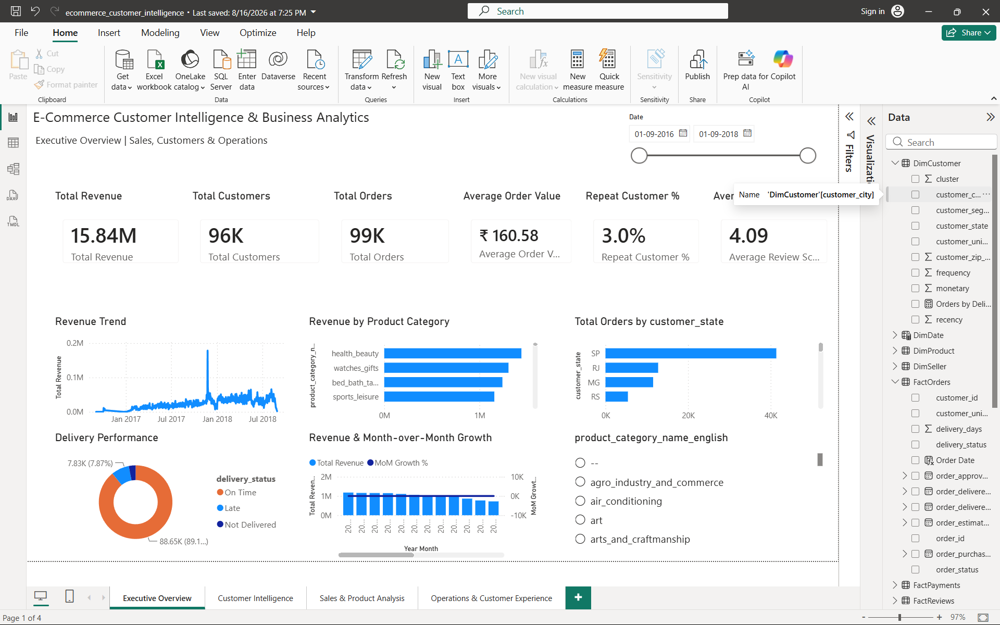
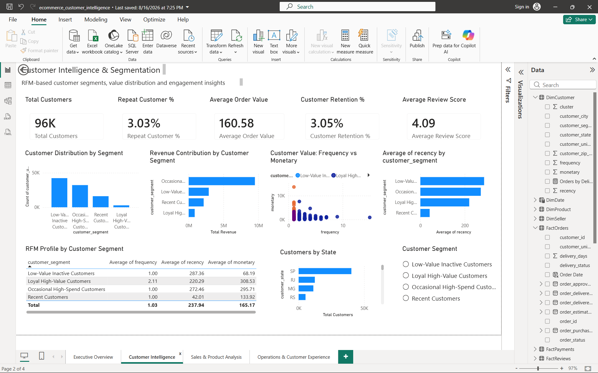
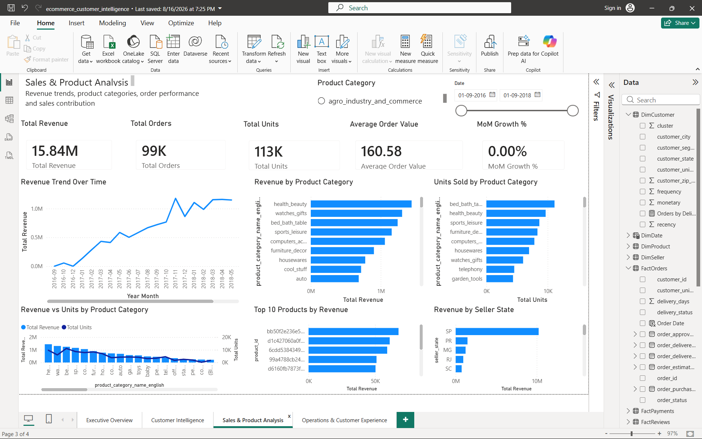
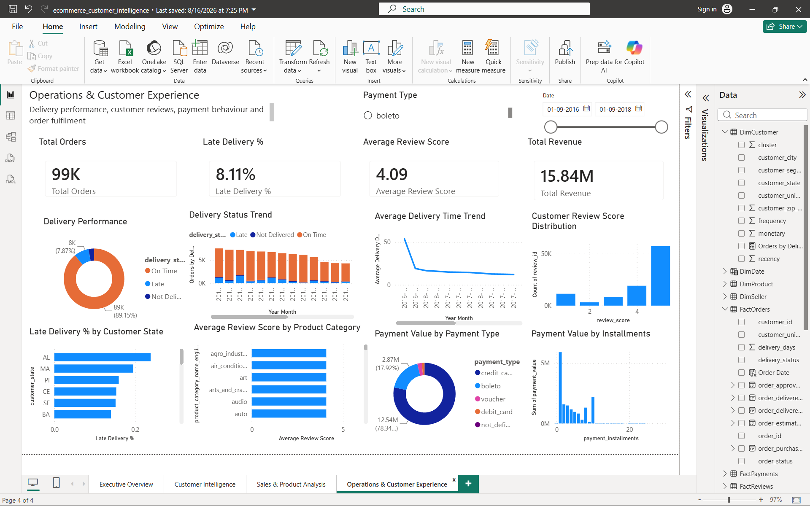
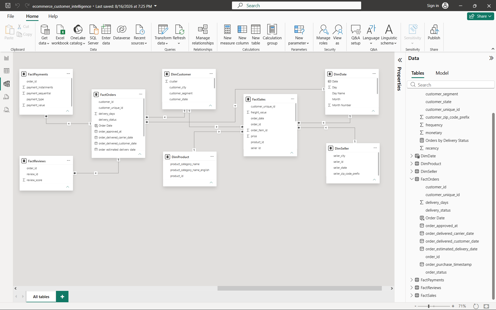

# E-Commerce Customer Intelligence & Business Analytics

An end-to-end e-commerce analytics project built on the Brazilian **Olist** dataset, analyzing sales performance, customer behavior, RFM-based segmentation, seller performance, delivery operations, payment behavior, customer satisfaction, and freight costs.

The project combines **MySQL, Python, RFM Analysis, and Power BI** to transform raw transactional data into actionable business insights and recommendations.


**🔗 [Live Interactive Dashboard →](https://your-app-name.streamlit.app)** *(replace with your deployed Streamlit Cloud link — see `streamlit_app/README.md`)*

---

## Table of Contents

1. [Project Overview](#1-project-overview)
2. [Business Problem](#2-business-problem)
3. [Objectives](#3-objectives)
4. [Dataset](#4-dataset)
5. [Tech Stack](#5-tech-stack)
6. [Project Architecture](#6-project-architecture)
7. [Repository Structure](#7-repository-structure)
8. [Database Schema](#8-database-schema)
9. [Data Quality](#9-data-quality)
10. [SQL Analysis](#10-sql-analysis)
11. [Python EDA & RFM Segmentation](#11-python-eda--rfm-segmentation)
12. [Power BI Dashboard](#12-power-bi-dashboard)
13. [Key Findings](#13-key-findings)
14. [Business Recommendations](#14-business-recommendations)
15. [How to Reproduce This Project](#15-how-to-reproduce-this-project)
16. [Future Improvements](#16-future-improvements)
17. [Author](#17-author)

---

## 1. Project Overview

This project analyzes the Olist e-commerce marketplace dataset to understand how the business performs across sales, customers, products, sellers, logistics, payments, and customer experience.

The project follows a complete analytics workflow:

**Raw Data → Data Quality Validation → SQL Analysis → Python EDA → RFM Segmentation → Processed Analytical Data → Power BI Data Model → Interactive Dashboard → Business Insights & Recommendations**

The analysis is organized around **16 core business questions** covering:

- Sales & Revenue
- Customer Behavior
- Seller Performance
- Delivery & Logistics
- Payment Behavior
- Customer Satisfaction
- Freight & Cost Analysis
- Overall Business Opportunities and Problems

The full list of business questions is documented in [`docs/business_questions.md`](docs/business_questions.md).

---

## 2. Business Problem

An e-commerce marketplace generates large amounts of transactional, customer, product, seller, payment, review, and logistics data.

However, raw transactional data alone does not answer important business questions such as:

- How is overall sales performance?
- Which product categories generate the most revenue?
- Are customers returning after their first purchase?
- Which customer segments generate the most value?
- Which sellers drive marketplace revenue?
- Where are the major delivery problems?
- Does late delivery affect customer satisfaction?
- Which payment methods are most important?
- How significant are freight costs?
- Where are the biggest opportunities for improving revenue and customer retention?

The goal of this project is to transform the raw Olist dataset into a structured analytical solution that answers these questions and provides business-oriented recommendations.

---

## 3. Objectives

1. Analyze overall sales and revenue performance.
2. Identify revenue and order trends over time.
3. Determine the strongest product categories and products.
4. Understand customer geographic distribution.
5. Measure customer loyalty and repeat-purchase behavior.
6. Identify high-value customers.
7. Evaluate seller performance.
8. Measure seller revenue concentration.
9. Analyze delivery performance.
10. Identify geographic and seller-level logistics problems.
11. Track delivery performance over time.
12. Understand payment methods and payment value.
13. Measure customer satisfaction.
14. Analyze the relationship between delivery performance and review scores.
15. Measure the impact of freight costs.
16. Derive actionable business insights and recommendations.

---

## 4. Dataset

The project uses the **Brazilian Olist E-Commerce Dataset**, containing real, anonymized transactional data from a Brazilian e-commerce marketplace.

### Raw datasets (`data/raw/`)

| Dataset | Description |
|---|---|
| `olist_customers_dataset.csv` | Customer IDs, locations, and customer identifiers |
| `olist_orders_dataset.csv` | Order status, purchase, approval, and delivery timestamps |
| `olist_order_items_dataset.csv` | Products, sellers, prices, and freight values for each order item |
| `olist_order_payments_dataset.csv` | Payment methods, installments, and payment values |
| `olist_order_reviews_dataset.csv` | Customer review scores and review information |
| `olist_products_dataset.csv` | Product attributes and category information |
| `olist_sellers_dataset.csv` | Seller identifiers and seller locations |
| `olist_geolocation_dataset.csv` | Brazilian ZIP-code geolocation information |
| `product_category_name_translation.csv` | Portuguese-to-English product category mapping |

### Dataset scale

- **~99K** customers
- **~99K** orders
- **~112K** order items
- **~103K** payment records
- **~99K** review records
- **~33K** products
- **~3K** sellers
- **1M+** geolocation records

### Processed datasets (`data/processed/`)

Analytical, dashboard-ready datasets exported from the SQL and Python layers:

| File | Description |
|---|---|
| `kpi_summary.csv` | Headline business KPIs |
| `monthly_sales.csv` | Monthly revenue, orders, AOV, and MoM growth |
| `category_summary.csv` | Revenue, items sold, and orders by product category |
| `customer_analysis.csv` | Order count, revenue, and customer type per customer |
| `new_customers_monthly.csv` | New customer acquisition by month |
| `seller_summary.csv` | Revenue, orders, and items sold per seller |
| `payment_summary.csv` | Orders, payment value, and average payment by method |
| `delivery_review_summary.csv` | Review scores and delivery time by on-time/late status |
| `rfm_customer_segments.csv` | Customer-level Recency, Frequency, Monetary values, and cluster/segment |
| `rfm_segment_summary.csv` | Aggregated segment-level RFM summary |

> **Note:** This dataset is publicly available (Olist Brazilian E-Commerce Public Dataset). Raw CSVs are included here for reproducibility of the SQL/Python pipeline.

---

## 5. Tech Stack

**Database & SQL**
MySQL · CTEs · Window Functions · Views · Aggregations · Joins · Data Quality Validation

**Python**
Pandas · NumPy · Matplotlib · Seaborn · Scikit-learn

**Customer Analytics**
RFM Analysis (Recency, Frequency, Monetary) · Customer Segmentation · K-Means Clustering · Elbow Method · Silhouette Score

**Business Intelligence**
Microsoft Power BI · Power Query · DAX · Star Schema · Interactive Filters/Slicers · KPI Cards · Drill-through

**Deployment**
Streamlit · Plotly · Streamlit Community Cloud (browser-based, no install required — see [Live Demo](#12-power-bi-dashboard))

**Version Control**
Git · GitHub

---

## 6. Project Architecture

```text
                    ┌─────────────────────────┐
                    │      Raw Olist Data      │
                    │        CSV Files         │
                    └────────────┬─────────────┘
                                 │
                                 ▼
                    ┌─────────────────────────┐
                    │    MySQL Data Layer      │
                    │                          │
                    │ • Data Loading           │
                    │ • Data Quality Checks    │
                    │ • Validation             │
                    │ • Analytical Queries     │
                    │ • Reusable SQL Views     │
                    └────────────┬─────────────┘
                                 │
                    ┌────────────┴────────────┐
                    │                          │
                    ▼                          ▼
          ┌──────────────────┐       ┌──────────────────┐
          │   Python EDA      │       │   RFM Analysis    │
          │                   │       │                   │
          │ • Cleaning        │       │ • Recency         │
          │ • EDA             │       │ • Frequency       │
          │ • Trends          │       │ • Monetary        │
          │ • Distributions   │       │ • K-Means Cluster │
          └────────┬──────────┘       └────────┬──────────┘
                   │                            │
                   └────────────┬───────────────┘
                                ▼
                    ┌─────────────────────────┐
                    │   Processed Datasets     │
                    │                          │
                    │ • KPI Summary            │
                    │ • Monthly Sales          │
                    │ • Category Summary       │
                    │ • Customer Analysis      │
                    │ • Seller Summary         │
                    │ • Payment Summary        │
                    │ • Delivery Analysis      │
                    │ • RFM Results            │
                    └────────────┬─────────────┘
                                 │
                                 ▼
                    ┌─────────────────────────┐
                    │        Power BI          │
                    │                          │
                    │ • Data Model             │
                    │ • DAX Measures           │
                    │ • KPIs                   │
                    │ • Interactive Dashboard  │
                    └────────────┬─────────────┘
                                 │
                                 ▼
                    ┌─────────────────────────┐
                    │  Business Insights &     │
                    │    Recommendations       │
                    └─────────────────────────┘
```

---

## 7. Repository Structure

```text
E-COMMERCE CUSTOMER INTELLIGENCE & BUSINESS ANALYTICS/
│
├── data/
│   ├── raw/                 # Original Olist CSV files
│   └── processed/           # Cleaned, aggregated, analysis-ready datasets
│
├── docs/
│   └── business_questions.md   # 16 core business questions guiding the analysis
│
├── notebooks/
│   ├── 01_eda.ipynb            # Exploratory Data Analysis
│   └── 02_rfm_clustering.ipynb # RFM analysis & K-Means customer segmentation
│
├── powerbi/
│   └── ecommerce_customer_intelligence.pbix   # Power BI dashboard
│
├── streamlit_app/
│   ├── app.py                   # Deployable browser-based dashboard
│   ├── requirements.txt
│   ├── README.md                # Deployment instructions
│   └── data/                    # Lightweight copies of processed CSVs
│
├── sql/
│   ├── schema.sql            # Database schema (table definitions)
│   ├── data_quality.sql      # Data validation & quality checks
│   └── analysis.sql          # Business analysis queries & views
│
└── README.md
```

---

## 8. Database Schema

The MySQL database is designed around the Olist transactional data.

### Main Tables

```text
customers
orders
order_items
payments
reviews
products
sellers
product_category_translation
```

### Main Relationships

```text
customers
    │  customer_id
    ▼
orders
    │
    ├──────────────► order_items ──────────► products
    │                    │
    │                    └─────────────────► sellers
    │
    ├──────────────► payments
    │
    └──────────────► reviews

products
    │
    └──────────────► product_category_translation
```

### Analytical Power BI Model

The Power BI model extends this structure into a **star schema**:

```text
                         DimCustomer
                              │
                              ▼
FactOrders ───────────► FactSales
                              │
                              ▼
                         DimProduct

FactOrders
    │
    ▼
FactPayments
    │
    ▼
FactReviews

DimDate ──────────────► FactSales / FactOrders
DimSeller ────────────► FactSales
```

The Power BI model contains:

- `DimCustomer`, `DimDate`, `DimProduct`, `DimSeller`
- `FactOrders`, `FactSales`, `FactPayments`, `FactReviews`

---

## 9. Data Quality

Before performing the business analysis, the raw data was systematically validated using [`sql/data_quality.sql`](sql/data_quality.sql).

The data-quality layer checks:

- Row counts across all tables
- Duplicate records (`customer_id`, `order_id`, etc.)
- NULL values
- Primary-key uniqueness
- Foreign-key relationships / referential integrity
- Numeric ranges (product prices, freight values, payment values, installments)
- Review score validity (must fall within 1–5)
- Order status values
- Customer and seller ZIP codes
- Date and timestamp consistency, including delivery-date consistency
- Product category translation coverage

**Key findings from validation:**

- Review scores were confirmed to fall within the expected `1–5` range with no invalid values.
- Timestamp anomalies were identified and intentionally **retained** (not silently modified or deleted) to keep the analysis transparent and reproducible:
  - **166 orders** have a carrier-delivery timestamp earlier than the purchase timestamp.
  - **23 orders** have a customer-delivery timestamp earlier than the carrier-delivery timestamp.

---

## 10. SQL Analysis

SQL ([`sql/analysis.sql`](sql/analysis.sql)) is the primary analytical layer used to answer the project's business questions, built with CTEs, window functions, and reusable views.

**Sales Analysis** — Overall revenue, total orders, AOV, freight, monthly revenue/order volume, MoM revenue growth, category revenue & contribution, top products.

**Customer Analysis** — Customer geography (state/city), customer orders and revenue, one-time vs. repeat customers, purchase frequency. Retention is measured using delivered orders grouped by `customer_unique_id`.

**Seller Analysis** — Seller revenue, orders, quantity sold, seller AOV, seller delivery performance and late-delivery rate, revenue concentration among top sellers.

**Logistics Analysis** — Average delivery time, late delivery rate, average delay, state-level and seller-level delivery performance, monthly delivery trends. Seller-level delivery analysis applies a minimum order threshold to avoid drawing conclusions from very small samples.

**Payment Analysis** — Orders and revenue by payment method, average payment value, average installments.

**Customer Satisfaction** — Average review score, review distribution, review score by category and by delivery status.

**Delivery vs. Satisfaction** — Direct comparison of review scores for on-time orders vs. late orders.

**Freight Analysis** — Total and average freight, freight-to-product-value ratio, freight by category.

---

## 11. Python EDA & RFM Segmentation

### Exploratory Data Analysis — [`notebooks/01_eda.ipynb`](notebooks/01_eda.ipynb)

```text
Data Loading → Data Inspection → Missing Value Analysis → Duplicate Analysis
    → Data Type Validation → Descriptive Statistics → Univariate Analysis
    → Bivariate Analysis → Time-Series Analysis → Customer Analysis
    → Category Analysis → Delivery & Review Analysis
```

The notebook analyzes sales trends, customer behavior, product/category performance, delivery patterns, review distributions, payment behavior, and customer acquisition patterns, and exports the processed outputs used by the Power BI dashboard.

### RFM Analysis & Customer Segmentation — [`notebooks/02_rfm_clustering.ipynb`](notebooks/02_rfm_clustering.ipynb)

RFM (Recency, Frequency, Monetary) segmentation was performed on delivered orders only, using `customer_unique_id` to identify unique customers:

- **Recency** — days since the customer's last purchase
- **Frequency** — number of distinct delivered orders
- **Monetary** — total spend (product price + freight)

**Workflow:**
1. Filter delivered orders and connect orders to customers via `customer_unique_id`.
2. Compute customer-level Recency, Frequency, and Monetary values.
3. Apply `log1p()` transformation to reduce the effect of skew in Frequency and Monetary.
4. Standardize features with `StandardScaler`.
5. Determine the optimal number of clusters using the **Elbow Method** and **Silhouette Score**.
6. Train the final **K-Means** model and profile each cluster using original (untransformed) RFM values.
7. Assign business-friendly segment names based on cluster characteristics.
8. Export customer-level and segment-level results for Power BI.

**Resulting customer segments:**

| Segment | Customers | % of Customers | Avg Recency (days) | Avg Frequency | Avg Monetary | Total Revenue |
|---|---:|---:|---:|---:|---:|---:|
| Low-Value / Inactive Customers | 42,285 | 45.29% | 287.4 | 1.0 | R$68.19 | R$2,883,293 |
| High-Value One-Time Customers | 32,189 | 34.48% | 272.5 | 1.0 | R$295.71 | R$9,518,487 |
| Recent Customers | 16,083 | 17.23% | 42.0 | 1.0 | R$133.92 | R$2,153,806 |
| Loyal High-Value Customers | 2,801 | 3.00% | 220.3 | 2.11 | R$308.53 | R$864,187 |

---

## 12. Power BI Dashboard

The dashboard ([`powerbi/ecommerce_customer_intelligence.pbix`](powerbi/ecommerce_customer_intelligence.pbix)) is built on a star-schema data model and provides an interactive view of the full analysis, including:

- Executive KPI overview (revenue, orders, AOV, delivery, satisfaction)
- Revenue and order trends over time
- Category and product performance
- Customer segmentation (RFM) visuals
- Seller performance and revenue concentration
- Delivery performance by geography and seller
- Payment method breakdown
- Review score analysis and delivery-vs-satisfaction comparison
- Freight cost analysis

> Open the `.pbix` file in **Power BI Desktop** to explore the fully interactive report with slicers and drill-throughs.

### Dashboard Preview

**Page 1 — Executive Overview**
Headline KPIs (revenue, customers, orders, AOV, repeat rate, review score), revenue trend, revenue by category, orders by state, delivery performance, and revenue vs. MoM growth.



**Page 2 — Customer Intelligence & Segmentation**
RFM-based customer segments, revenue contribution by segment, frequency vs. monetary value, and a segment-level RFM profile table.



**Page 3 — Sales & Product Analysis**
Revenue trend over time, revenue and units sold by product category, top 10 products by revenue, and revenue by seller state.



**Page 4 — Operations & Customer Experience**
Delivery performance and status trend, average delivery time trend, review score distribution, late delivery % by state, review score by category, and payment value by type/installments.



**Power BI Data Model**
Star-schema model showing `FactOrders`, `FactSales`, `FactPayments`, and `FactReviews` connected to `DimCustomer`, `DimDate`, `DimProduct`, and `DimSeller`.



---

## 13. Key Findings

Based on the processed KPI, category, seller, delivery, and payment summaries:

- **Overall performance:** The marketplace generated **R$13.22M** in total revenue from **96,478 orders** and **93,358 customers**, at an Average Order Value of **R$137.04**.
- **Delivery:** Average delivery time is **12.6 days**, with a **late delivery rate of 8.1%**. Late orders average **31.4 days** to deliver vs. **10.9 days** for on-time orders.
- **Delivery drives satisfaction:** On-time orders average a **4.29/5** review score, compared to just **2.57/5** for late orders — a clear, direct link between logistics performance and customer satisfaction.
- **Retention is a weak point:** The overall repeat customer rate is only **~3%**, and RFM segmentation shows **45.3%** of customers fall into a **Low-Value / Inactive** segment. Only **3%** of customers are both loyal and high-value.
- **Revenue concentration:** The top 10% of sellers generate roughly **67%** of total marketplace revenue, indicating heavy dependence on a relatively small group of high-performing sellers.
- **Category performance:** `health_beauty`, `watches_gifts`, and `bed_bath_table` are the top three revenue-generating categories.
- **Payments:** Credit card is the dominant payment method, used in **~79%** of orders and accounting for the majority of payment value; boleto is a distant second.
- **Average customer satisfaction** across the platform is **4.09/5**, indicating generally positive experiences outside of late-delivery cases.

---

## 14. Business Recommendations

1. **Improve delivery reliability**, especially for the ~8% of orders that arrive late — this segment shows a nearly 1.7-point drop in average review score.
2. **Invest in customer retention programs** targeting the large Low-Value/Inactive and High-Value One-Time segments, since the platform's repeat-purchase rate is currently very low.
3. **Nurture and reward the Loyal High-Value segment** (3% of customers, disproportionately valuable) with loyalty incentives to protect and grow this base.
4. **Reduce seller concentration risk** by supporting mid-tier sellers, since a small group of top sellers currently drives the majority of revenue.
5. **Prioritize logistics investment in the categories and states with the highest late-delivery rates**, using the seller- and state-level delivery views in `analysis.sql`.
6. **Continue promoting high-converting categories** (health & beauty, watches & gifts, bed/bath/table) while investigating underperforming categories for freight or delivery issues.

---

## 15. How to Reproduce This Project

### Prerequisites
- MySQL (8.0+ recommended)
- Python 3.10+ with `pandas`, `numpy`, `matplotlib`, `seaborn`, `scikit-learn`, `jupyter`
- Power BI Desktop (Windows)

### Steps

1. **Set up the database**
   ```bash
   mysql -u root -p -e "CREATE DATABASE ecommerce_analytics;"
   mysql -u root -p ecommerce_analytics < sql/schema.sql
   ```
   Load the raw CSVs from `data/raw/` into their corresponding tables (via `LOAD DATA INFILE`, MySQL Workbench Import Wizard, or a Python loading script).

2. **Run data quality checks**
   ```bash
   mysql -u root -p ecommerce_analytics < sql/data_quality.sql
   ```

3. **Run the business analysis SQL**
   ```bash
   mysql -u root -p ecommerce_analytics < sql/analysis.sql
   ```

4. **Run the Python notebooks**
   ```bash
   jupyter notebook notebooks/01_eda.ipynb
   jupyter notebook notebooks/02_rfm_clustering.ipynb
   ```
   These notebooks read from `data/raw/` (and/or the SQL layer) and export the analytical datasets into `data/processed/`.

5. **Open the Power BI dashboard**
   Open `powerbi/ecommerce_customer_intelligence.pbix` in Power BI Desktop and refresh the data source to point at your local `data/processed/` files.

---

## 16. Future Improvements

- Automate the SQL → Python → Power BI pipeline with a scheduling/orchestration tool (e.g., Airflow).
- Add a cohort-based retention analysis in addition to RFM segmentation.
- Deploy the Power BI report to the Power BI Service for online sharing.
- Add unit tests for the data-quality and transformation logic.
- Incorporate the geolocation dataset into a geographic delivery-performance map.

---

## 17. Author

Built as a portfolio project demonstrating an end-to-end analytics workflow: **SQL data modeling & analysis → Python EDA & machine-learning-based segmentation → Power BI business intelligence dashboard.**

Feel free to explore the notebooks, SQL scripts, and dashboard, and reach out with any questions or feedback.
